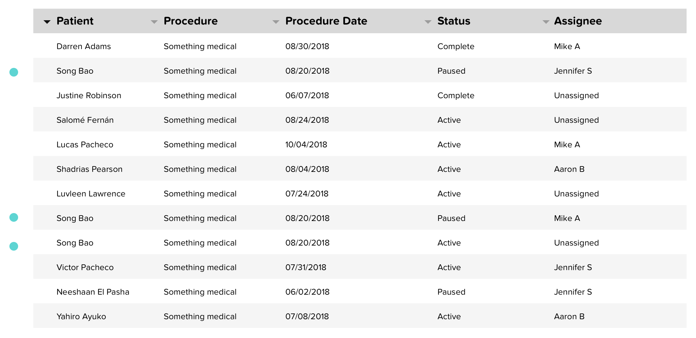
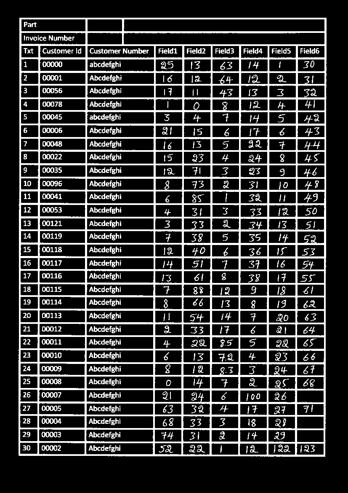
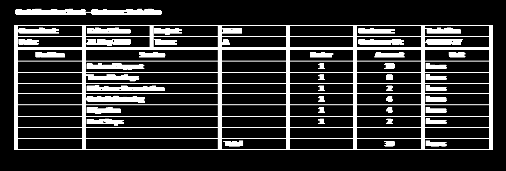
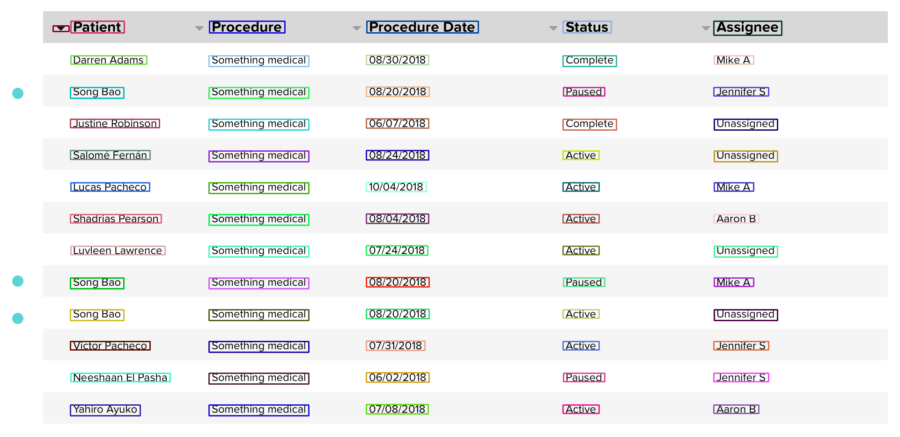

#Multi Face-mask detection using SSD:-

##Prerequisites :-

* [OpenCV]()
* [kraken]()
* [PIL]()
* [Pandas]()
* [Imutils]()


### Installing Requirements:

Install requirements from requirements.txt
```
pip install -r requirements.txt
```

##Project Structure:-

* [images]() :- This folder contains images to be used for OCR.
* [output_csv]() :- It contains result of tabular image in csv file.
* [processed_image]() :- Contains images generated while pre-processing.
* [en-default.mlmodel]() :- Trained english language model.
* [requirements.txt]() :- Requirement file.
* [tabular_image-to-csv.py]() :- Code file.


## Python command  to run script

```
python3 tabular_image-to-csv.py --img-path images/patient.png
```

### Original:-



### Original:-


### Threashold:-



### Dialated:-



### ROI:-




    
